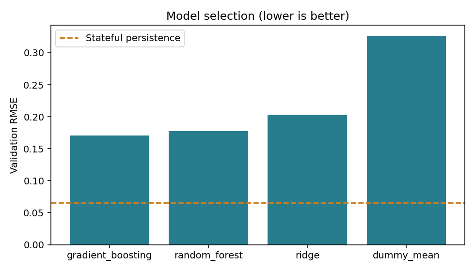

# Prédiction du stress hydrique des cultures

MLOps project: **next-day regression of a modeled wheat water-stress
index**, using real NASA POWER weather and explicitly assumed soil scenarios in
Morocco. Modular Python scripts implement ingestion, validation, causal features,
chronological evaluation, MLflow tracking/registry, FastAPI, Docker and monitoring.

**Labels are not measured crop stress.** Reported accuracy means agreement with a
documented water-balance proxy, not validation of irrigation decisions. Metrics,
tables, plots and notebook outputs are generated by the actual pipeline.

## 1. Problem, sources and target

Daily observations span January 2015–June 2024 at Meknes, Settat and Marrakech.
The scenario is rainfed wheat, November 15 sowing and a 180-day season. Soil field
capacity, wilting point and rooting depth are **assumptions**, not measurements.
The first year is reserved for soil-balance spin-up.

Target: tomorrow's **`1 − Ks`**, a dimensionless [0,1] index from a continuous,
stress-limited soil-water bucket. Zero means no modeled stress; one means maximal
modeled limitation. Hargreaves-Samani approximates reference ET. Features use only
weather available by the end of today and static scenario information.

* [NASA POWER daily API](https://power.larc.nasa.gov/docs/services/api/temporal/daily/):
  credential-free temperature mean/max/min, precipitation, humidity, wind and solar
  radiation. Raw metadata and units are preserved.
* [FAO-56](https://www.fao.org/4/X0490E/x0490e00.htm): methodological reference;
  no downloaded FAO soil or field-label dataset is claimed.
* [FAO WaPOR](https://www.fao.org/in-action/remote-sensing-for-water-productivity/wapor-data-access/en):
  investigated for future ET/environmental enrichment, not currently a training input.
* [Earth Engine](https://developers.google.com/earth-engine/guides/auth): requires
  authentication/project setup and is deferred. The main pipeline does not need it.

See [methodology and decisions](docs/methodology.md) for equations, units, scenario
assumptions, feature rationale and source investigation.

## 2. Architecture

```text
crop-water-stress-mlops/
├── configs/config.yaml              # Sources, crop/soil scenario, splits, models
├── data/{raw,interim,processed}/     # Immutable JSON → validated CSV → features
├── src/
│   ├── data/                        # Collection, preprocessing, validation
│   ├── features/                    # Auditable proxy + shared causal features
│   ├── models/                      # Train, evaluate, registry, predict
│   ├── api/                         # FastAPI, Pydantic, genuine example request
│   ├── utils/                       # Configuration, logging, hashes/receipts
│   └── reports.py                   # Train-only EDA and generated results
├── notebooks/                       # Executable EDA and experiment inspection
├── tests/                           # Data, science, model, API, monitoring
├── models/                          # Versions and candidate/production pointers
├── mlruns/                          # SQLite database and MLflow artifacts
├── artifacts/                       # Metrics, plots, predictions, provenance
├── monitoring/                      # Drift script, HTML/JSON reports, API events
├── docs/                            # Methodology and demo guide
├── .github/workflows/ci.yml
├── Dockerfile / docker-compose.yml
├── requirements.txt / requirements-lock.txt / requirements-api.txt
└── Makefile
```



```mermaid
flowchart LR
  NASA[NASA POWER] --> RAW[Immutable snapshots + hashes]
  RAW --> QC[Validation]
  QC --> F[Causal features + proxy labels]
  F --> TRAIN[Chronological validation selection]
  TRAIN --> ML[MLflow candidate + refit]
  ML --> EVAL[Frozen test evaluation]
  EVAL --> PROD[Production promotion]
  PROD --> API[FastAPI / Docker]
  API --> MON[Quality and drift monitoring]
```

## 3. Installation and configuration

Use Python **3.12**, the tested version. Run from this project directory.

```bash
python3.12 -m venv .venv
source .venv/bin/activate
python -m pip install -r requirements.txt
python -m pip check
```

`requirements.txt` pins direct dependencies and constrains transitive versions using
the tested `requirements-lock.txt`. `requirements-api.txt` is the smaller serving
environment. Fixed seeds and single-threaded training reduce variability; cross-platform
bitwise equality is not promised. No paid services, credentials or API keys are needed.

`make install` creates `.venv` using your `python3`. Make uses `.venv/bin/python`;
override with `make PYTHON=python test` if needed. Configuration is in
`configs/config.yaml`; environment options are in [.env.example](.env.example).
Export variables explicitly: `.env` is not silently loaded. Paths resolve from the
project root. Models retain their training configuration for consistent prediction.

## 4. Acquisition, preprocessing and offline fallback

```bash
make data
make preprocess
make features
# Equivalent modules:
python -m src.data.collect_data
python -m src.data.preprocess
python -m src.features.build_features
```

Request-addressed NASA snapshots are never overwritten. Repeat collection verifies
and reuses them. Retries handle temporary HTTP errors. Validation checks units, full
date coverage, required columns, numeric types, missing values, duplicates, temperature
ordering, negative precipitation, humidity/wind/radiation bounds, soil assumptions
and target validity. Unknown units or major violations fail clearly. Missing NASA
fill values are detected; no interpolation or future-value imputation is performed.

```bash
python -m src.data.collect_data --offline
make preprocess features
```

Offline operation needs genuine snapshots and manifests from a prior download.
A clean machine without access must receive that archive. No fabricated dataset is
substituted. NASA AG radiation is normalized to MJ/m²/day; weather is gridded data,
not a sensor installed at the farm.

## 5. Full pipeline, features and temporal evaluation

```bash
make pipeline
```

This runs collection, preprocessing, features, training, evaluation, local promotion,
reports, an API example and monitoring sequentially. Individual modeling commands:

```bash
make train
make evaluate
make promote
make reports
make example
make monitor
```

| Split | Target-date boundary | Purpose |
|---|---|---|
| Train | ≤ 2021-06-30, after spin-up | Fit models and preprocessing |
| Validation | 2021-07-01 through 2022-06-30 | Select by RMSE |
| Test | After 2022-06-30 through data end | Evaluate frozen refit |

Actual active-season ranges/counts are in `artifacts/dataset_manifest.json`. All sites
use the same cutoffs; no random split is used. Features include today's weather,
temperature range, approximate VPD, ET0, 7/30-day rain, 7-day mean temperature,
30-day precipitation-minus-ET0, lagged rain, seasonal terms and scenario soil storage.
Windows are causal and isolated by site. The exact same function builds API features.
Stress, simulated soil moisture and depletion are excluded from ML inputs.

Models: Dummy mean, scaled Ridge, Random Forest and histogram gradient boosting.
The Ridge scaler fits inside its pipeline; boosting's random internal early stopping
is disabled. Lowest validation RMSE selects a configuration; it is refitted on
train+validation, frozen, then evaluated on test. All models use identical [0,1]
prediction clipping during scoring and serving. MAE, RMSE and R² are logged; MAPE
is omitted because zero is a valid target.

`make evaluate` reuses the frozen report for an already evaluated model version.
Repeated training creates new versions, but exposed test outcomes must not guide
tuning. Further scientific experiments require a fresh holdout.

## 6. EDA and notebooks

```bash
make reports      # After evaluation; also publishes final results
make notebooks
```

EDA includes dimensions, descriptive statistics, missing values, distributions,
correlations, target time series, weather relationships and IQR outlier counts.
Outcome exploration uses **training rows only**. Valid extremes are retained;
off-season gaps are not connected in target plots. `01_data_exploration.ipynb`
calls reusable plotting code. `02_model_experiments.ipynb` inspects actual validation
comparisons and MLflow runs without selecting models on test outcomes.

## 7. MLflow tracking and model lifecycle

```bash
make mlflow
# Equivalent from project root:
mlflow ui --backend-store-uri sqlite:///mlruns/mlflow.db --port 5000
```

Open http://localhost:5000, experiment `crop-water-stress-wheat`. Runs contain model
configuration, seed, dataset hash, feature names, metrics, plots, fitted model,
signature and input examples. The candidate run stores the refit, selection scores
and its subsequent test evaluation.

Registry model: `crop-water-stress`, with `candidate` and `production` aliases.
Training changes candidate only. `make promote` requires a matching frozen evaluation
and updates production. This demonstrates lifecycle control; it is not agronomic
certification or a test-score selection gate. Local immutable model files and a
checksum-verified `models/production.json` let the API run without MLflow online.
Restart the API after promotion. Rollback:

```bash
python -m src.models.registry --version YOUR_PREVIOUS_EVALUATED_VERSION
```

Use only trusted locally produced joblib models. API pointers are relative/portable.
MLflow's local artifact paths are absolute: preserve the original mount path when
migrating history (see Komodo Deployment). The default is local tracking; an optional
`MLFLOW_TRACKING_URI` needs a properly configured server/artifact store.

## 8. Git and lightweight data versioning

Git tracks source, configuration, lockfile, notebooks and selected generated reports.
Bulk raw/processed data, development models, environments and tracking databases are ignored.
The evaluated production model and three verified NASA snapshots are explicit Git exceptions
so a clean deployment works without training or live data downloads.
Snapshot SHA-256 manifests and `artifacts/provenance/*.json` record stage input/output,
config and source hashes plus Python version. Dataset and model integrity is checked
before training, evaluation and serving.

This small project uses that lightweight alternative to DVC: audit and replay without
another service. It does **not** provide DVC remote storage, dependency caching or
automatic historical artifact retention. Archive artifacts for submission or old runs:

```bash
mkdir -p /tmp/cws-backup
tar -czf /tmp/cws-backup/real-data-and-models.tar.gz data models mlruns artifacts
# Restore into a separate project copy, preserving existing raw snapshots.
```

Publish this directory as the GitHub repository root so `.github/workflows/ci.yml`
is discovered. The local pipeline does not publish to GitHub automatically.

## 9. FastAPI

```bash
make example
make api
# Another terminal:
curl --fail-with-body http://localhost:8000/
curl --fail-with-body http://localhost:8000/health
make demo-request
```

Swagger: http://localhost:8000/docs. The generated `artifacts/example_request.json`
contains real downloaded weather: `site_id`, `crop: wheat`, and exactly 30 ordered,
consecutive daily `history` records. Fields: date, temperature, max/min temperature,
precipitation, humidity, wind speed, solar radiation. Soil properties come from the
model's configured site scenario; arbitrary soils/new locations are not supported.

Response fields: numerical `prediction`, `forecast_date`, `model_version`, `unit`,
`target`, and interpretation-only `stress_level` (low <0.3, medium <0.6, high otherwise).
Thresholds are illustrative, not agronomic actions. This is an end-of-day forecast,
requiring today's observations. Invalid or out-of-season requests return 422.
Missing/corrupt artifacts produce 503 readiness/prediction responses; application
import remains possible without a model for CI.

## Web Interface

The Streamlit client supports **Automatic Weather** and **Manual / File**. Both use
one prediction/result component and the existing serving contract:

```text
User → Streamlit → request builder → HTTP POST FastAPI /predict → production model
```

Install dependencies once: `.venv/bin/python -m pip install -r requirements.txt`.
Run from the project root, in two terminals:

```bash
# Terminal 1
make api
```

```bash
# Terminal 2
make ui
```

Open [http://localhost:8501](http://localhost:8501). The top status checks `/health`
and displays the loaded model version. If necessary, start the API and click
**Refresh status**. Set `CWS_API_URL` to use a different API address.

### Automatic Weather

1. Select **Automatic Weather**.
2. Choose crop, configured site and **prediction date** (the forecast target date).
3. Click **Fetch Weather Data**.
4. Review the source/mode, period, weather summary and **View Historical Weather**.
5. Expand **Advanced — View API Request** to show the generated full JSON.
6. Click **Predict Water Stress** and inspect the result.

The default date/site come from the existing example where available: Marrakech,
16 November 2022. The request builder retrieves the required 30 consecutive days
from 17 October through 15 November, not the target day's weather. All daily rows
are sent to FastAPI; summary averages are display-only. Automatic data are read-only.
Changing the selection invalidates the loaded request and previous prediction.

`ui/weather.py` reuses `collect_data.collect`, its configured NASA parameters/site
coordinates, AG community and local solar time (LST), plus the training
`normalize_payload` function. This preserves variable definitions and units, including
kWh/m²/day → MJ/m²/day radiation conversion where required. API schemas validate the
complete normalized request; no model or feature engineering runs in Streamlit.

**Cache/offline behavior:** verified local NASA snapshots are preferred. Their source,
coordinates, parameters, time standard, requested coverage and SHA-256 are checked,
and their actual daily data must pass the API contract. If no suitable snapshot exists,
the existing NASA downloader retrieves the exact window into `data/raw/ui_weather/`,
with its normal request-addressed filename and manifest. Batch training snapshots are
never overwritten. New UI snapshots can be reused offline.

**Try NASA POWER first** optionally attempts retrieval before using a broader local
snapshot. Exact saved requests are still reused under the existing immutable-cache
policy. If retrieval fails, a suitable verified snapshot is used and visibly labeled
**Offline cached snapshot**. New downloads are labeled **Live**. With neither valid
NASA data nor a verified snapshot, the UI reports the problem and suggests
**Manual / File**. It never changes providers or fabricates weather. The existing
collector uses bounded timeouts and retries, so a live outage can take a few minutes;
leave live-first unchecked for the quickest offline demonstration.

Prediction dates cannot be in the future; recent observations may still be unpublished
or incomplete. The configured historical weather period is displayed, and dates beyond
it have no established evaluation results. The recorded held-out target period is
2022-11-16 through 2024-05-12 (`artifacts/dataset_manifest.json`). FastAPI remains
responsible for enforcing the trained scenario and active wheat season.

### Manual / File

This remains the default, reliable offline workflow:

1. Select **Manual / File** and click **Load Example**.
2. Review Wheat / Marrakech / 30 days from `artifacts/example_request.json`.
3. Optionally **Upload JSON** and choose **Use uploaded request**, or edit the
   **View / Edit Historical Weather** table.
4. Click **Predict Water Stress**.
5. Inspect the response and **Advanced — View API Request**.

This mode never contacts NASA and needs only the local API and production model.
Both modes display the API's score, stress level, forecast date, model version, unit
and target. This project uses a modeled stress proxy and not a directly measured
field stress label; it provides no irrigation prescription.

For a university demonstration, show Automatic Weather first using Marrakech and
16 November 2022: fetch → source/period → weather table → generated JSON → predict.
Then switch to Manual / File → Load Example → predict to show the reproducible
fallback. With the original verified snapshot, both modes generate the same request.

Stop each local service with Ctrl+C. Compose runs the API, UI and MLflow together;
`make ui` can also connect to the API container on port 8000.

## 10. Docker

The repository includes the existing evaluated production release. No training or
NASA access is needed to start serving. Build validation loads the model, verifies
its checksum and feature contract, and predicts the saved example.

```bash
# API-only workflow remains supported:
make docker
docker run --rm -p 8000:8000 crop-water-stress-api
# Full stack:
docker compose up --build -d
docker compose ps
docker compose logs --tail=100
# Stop without deleting persistent data:
docker compose down
```

All three services build from the root Dockerfile (targets `api`, `ui`, `tracking`).
They run as UID 10001. The API's `/health` checks model readiness; Streamlit waits
for a healthy API. MLflow is independent of serving. See the deployment section
below for ports, storage, remote setup and verification.

## 11. Tests and CI/CD

```bash
pytest
make lint
python -c "from src.api.main import app; assert app.title"
```

Tests cover invalid data, units, gaps, target bounds, known stress coefficients,
water conservation, ET conversion, future-perturbation causality, site isolation,
chronological assignment, model/API parity, bounded inference, artifact tampering,
API success/error paths and monitoring. Artificial fixtures are restricted to tests
and never generate scientific results. Tests need no NASA access or trained artifacts.

GitHub Actions installs the locked Python 3.12 dependencies, runs Ruff/pytest,
verifies release assets and imports the app. Local Docker is the deployment demonstration. No paid cloud,
automatic remote deployment or unexecuted GitHub run is claimed.

## 12. Monitoring

```bash
make monitor
# After serving requests locally:
python -m monitoring.drift --events monitoring/events.jsonl
```

Open `monitoring/historical_report.html` and `monitoring/simulated_report.html`;
JSON equivalents are generated too. Historical comparison uses validation reference
and held-out test weather/proxy labels. Reference predictions precede the refit, so
its performance ratio is a heuristic rather than a controlled degradation estimate.

The simulated report deliberately shifts feature distributions and injects bad/missing
values. It is explicitly simulated, not physically consistent future weather. It
has no labels and makes no performance claim. PSI and KS distance track inputs and
prediction distributions; minimum counts identify insufficient data.

API JSONL events contain version, site/date, request ID, features and predictions;
invalid requests are counted separately. The event reader creates `live_report.*`.
For delayed performance, join labels by site/forecast date and audit request/version,
then call `monitoring.drift.compare(reference, labeled_current, settings)`. Labels
must match the target definition; measured field labels require separate validation.
Group production reports by site, season and model version to distinguish expected
seasonality from drift. Alert thresholds are demonstration heuristics.

## 13. Actual results

<!-- RESULTS:START -->
Results below are generated by `python -m src.reports` from pipeline artifacts.

| Model | Validation MAE | Validation RMSE | Validation R² |
|---|---:|---:|---:|
| gradient_boosting | 0.1288 | 0.1706 | 0.6178 |
| random_forest | 0.1346 | 0.1774 | 0.5866 |
| ridge | 0.1647 | 0.2033 | 0.4571 |
| dummy_mean | 0.2934 | 0.3265 | -0.4002 |

Selected **gradient_boosting**, version `v4-2771746c21f7`.
Held-out test: **1074 observations**.

| Frozen test comparison | MAE | RMSE | R² |
|---|---:|---:|---:|
| Selected ML model | 0.1402 | 0.1886 | 0.6251 |
| Stateful persistence comparator | 0.0274 | 0.0597 | 0.9624 |

These measure agreement with the modeled proxy, **not measured crop stress**.
Persistence has access to today's full-history simulated state; the ML model
uses 30 days of weather and static scenario soil parameters. This information
advantage must be considered when interpreting the comparison.


<!-- RESULTS:END -->

Evidence: `artifacts/model_comparison.csv`, `artifacts/selection.json`,
`artifacts/dataset_manifest.json`, `artifacts/evaluation/<version>/test_metrics.json`.
Plots are in `artifacts/eda/` and the versioned evaluation directory.

## 14. Limitations and improvements

Constructed labels, assumed soil/calendar, gridded weather and three known locations
limit scientific claims. Daily rows are correlated; soil parameters are confounded
with site. No new-location/crop generalization, field validation or prediction
intervals are established. The bucket omits irrigation, groundwater, root growth
and separate soil evaporation. Approximate ET is uncalibrated locally.

Persistence is a strong comparator and can outperform the ML surrogate. With complete
weather history, the water balance itself calculates this defined proxy directly;
ML supplies an educational forecasting experiment, not demonstrated agronomic value.
Next steps: measured labels, local calibration, Penman-Monteith ET, causal satellite
enrichment, leave-location-out validation, rolling seasonal backtests, scenario
sensitivity and blocked uncertainty estimates. After seeing this test, use new
holdout data for further model development.

## 15. demonstration

Follow [docs/demo.md](docs/demo.md): architecture → assumptions → preprocessing →
training → MLflow → model version → API → Docker → tests → CI → monitoring.

## Original pipeline verification

At the original pipeline verification on Python 3.12: **34 tests passed**, Ruff checks passed, both notebooks executed
without cell errors, immutable snapshot reuse and frozen evaluation reuse passed,
and all recorded stage-output/model-source hashes matched. The Docker image built
successfully and its container passed health, Swagger, real-request inference parity
and invalid-input checks. See [API evidence](artifacts/api_verification.json),
[the actual example response](artifacts/example_response.json), and the monitoring
HTML reports. The GitHub workflow is supplied; remote Actions execution requires
publishing this project as your repository root.

## Komodo Deployment

The old Compose file already had `build: .`, but also `image: crop-water-stress-api`.
The repository has no workflow publishing that image. Komodo's automatic `compose pull` tries the registry
before building and fails on a clean server. In addition, Git excluded the model,
and the old stack included neither Streamlit nor MLflow. The new Compose file uses
build-only services, so Compose generates project-scoped image names. No private
registry, prebuilt laptop image, startup training, or NASA download is required.
Builds still need network access to the public Python base image and PyPI.

Configure a **Git repository Compose Stack**, not a Swarm stack:

| Komodo field | Value |
| --- | --- |
| Server | Select your intended server; `vh3` was supplied in the deployment request, but cannot be verified from Git |
| Git provider | `github.com` |
| Repo | `Anass-Erf/MLOPS_Project` (verified from origin) |
| Branch | `main` (verified locally) |
| Run Directory | `.` (repository root) |
| File Path | `docker-compose.yml` |
| Run Build (`run_build`) | **true** |
| Auto Pull (`auto_pull`) | **false** |
| Auto Update / Poll for Updates | **false** (redeploy on source changes) |
| Extra Args | none; on older Komodo without Run Build, use `--build` |
| Registry credentials | none |
| Environment | none required; optional overrides below |

Keep the Stack/project name stable: it determines named volume names. Clear any
inline Compose content so Komodo reads the Git file. A private repository requires
a configured Git account. See [Komodo Stack documentation](https://komo.do/docs/deploy/compose)
and the [Stack configuration definitions](https://github.com/moghtech/komodo/blob/main/client/core/rs/src/entities/stack.rs)
for `run_build` and `auto_pull`.

| Service | Built target | Host binding by default | Container endpoint | Persistent volume |
| --- | --- | --- | --- | --- |
| FastAPI `api` | `api` | `0.0.0.0:18000` | `http://api:8000` | `api-events` → `/app/monitoring` |
| Streamlit `ui` | `ui` | `0.0.0.0:18501` | `http://ui:8501` | `weather-cache` → `/app/data/raw/ui_weather` |
| MLflow `mlflow` | `tracking` | `127.0.0.1:15000` | `http://mlflow:5000` | `mlflow-data` → `/mlflow` |

All service images build locally from source; all use the public `python:3.12-slim`
base. No service pulls a prebuilt project or MLflow image. UI always uses
`CWS_API_URL=http://api:8000` in Compose. Health checks use localhost intentionally:
they probe the service inside its own container. API and MLflow bind 0.0.0.0 inside
their containers, as does Streamlit.

Enter these values in Komodo Environment (also the fallback defaults and `.env.example`):

```dotenv
CWS_BIND_ADDRESS=0.0.0.0
API_HOST_PORT=18000
UI_HOST_PORT=18501
CWS_MLFLOW_BIND_ADDRESS=127.0.0.1
MLFLOW_HOST_PORT=15000
```

These variables change only host ports. The defaults avoid the occupied host port
8000; if another selected port is occupied, choose a free host port for that service.
Remove the old `CWS_API_PORT`, `CWS_UI_PORT`, and `CWS_MLFLOW_PORT` entries;
those names are no longer used. Container ports and the UI API URL stay unchanged.
Open `http://<server>:18501` and `http://<server>:18000/docs` where the firewall permits.
MLflow is unauthenticated and bound to server loopback by default. Use an SSH tunnel
(`ssh -L 5000:127.0.0.1:15000 user@<server>`) then `http://localhost:5000`, or configure
an authenticated reverse proxy. Set its bind address to a private server address
only if direct access on that network is intended.

**Release files and offline behavior.** Git now includes the unchanged
`models/production.json`, `models/v4-2771746c21f7/model.joblib` and `metadata.json`.
The model SHA-256 is
`e8a7e2a6dfad19b4763d042694be00c4a72c234585579f4b3f8555110283fca4`, matching the
existing frozen evaluation. The model is about 400 KB; no retraining occurred.
Only this version enters the API image. A future release must update the Git and
Docker allowlists along with its pointer and evaluated artifact.

Three original NASA snapshot/manifest pairs in `data/raw` are included (about
1.2 MB total), covering the configured historical period at Marrakech, Meknes and
Settat. They retain their original bytes and checksum manifests. They enter only
the UI image, outside the mutable weather-cache mount. The UI includes
`artifacts/example_request.json`; Manual / File → Load Example and Automatic Weather
→ Marrakech → 16 November 2022 both work offline. New live NASA downloads persist
in `weather-cache`. For an uncached date, NASA availability is still required;
failure uses a matching verified snapshot or offers manual mode. Startup never
fetches NASA. No processed datasets or local `mlruns` enter any image.

**MLflow persistence and existing history.** The server uses SQLite at
`/mlflow/mlflow.db` and proxied artifact storage at `/mlflow/artifacts`, both in
`mlflow-data`. A new server starts with empty history; the release's local registry
version 4 does not imply that the new server already contains that registry entry.
The API reads its bundled verified model and does not depend on MLflow readiness.
For training clients inside the network set `MLFLOW_TRACKING_URI=http://mlflow:5000`;
for local clients using the tunnel set `MLFLOW_TRACKING_URI=http://localhost:5000`.
New HTTP experiments use the server artifact destination, avoiding laptop file URIs.
Local `make mlflow` / SQLite behavior is retained.

Existing laptop `mlruns` is untouched and not automatically migrated. Back it up
with writers stopped, including SQLite and all artifact directories. To retain
old history on another machine, preserve the absolute artifact paths recorded in
the database with matching mounts, or perform a separately validated MLflow
migration. Copying only the SQLite database into the new volume is insufficient.
Do not retrain merely to move history. Back up `mlflow-data` with MLflow stopped;
do not use `docker compose down -v` unless intentionally deleting deployment data.

**Monitoring.** API prediction and invalid-input events persist in `api-events`.
The existing drift tooling and reports remain in the repository. To analyze actual
server events, export the log from the server checkout and use the existing local
analysis environment:

```bash
docker compose cp api:/app/monitoring/events.jsonl /tmp/cws-events.jsonl
# Run where requirements.txt and the repository reports are available:
.venv/bin/python -m monitoring.drift --events /tmp/cws-events.jsonl
```

**Deploy and verify.** Commit and push all changed source files AND the newly
included model/snapshot files before deploying. In Komodo save the fields above,
refresh the Git source, then Deploy. Confirm the log builds all three targets and
all services become healthy. Equivalent server commands from the repository root:

```bash
docker compose config --quiet
docker compose build --no-cache
docker compose up -d --wait --wait-timeout 180
docker compose ps
docker compose logs --tail=100
curl --fail http://localhost:18000/health
curl --fail http://localhost:18000/docs
curl --fail http://localhost:18000/predict -H 'Content-Type: application/json' \
  --data-binary @artifacts/example_request.json
curl --fail http://localhost:18501/_stcore/health
curl --fail http://localhost:15000/health
# Exercise real Streamlit interactions and container-to-container HTTP:
docker compose exec -T ui python < scripts/smoke_ui.py
```

Use the overridden ports if applicable. The example predicts approximately
`0.8685826307973173`, version `v4-2771746c21f7`, forecast `2022-11-16`.
In the UI check Load Example → Predict Water Stress, then Automatic Weather →
Fetch Weather Data → Predict Water Stress. Both should return the same score.
`python scripts/verify_deployment_assets.py` verifies the model, evaluation checksum
and offline weather coverage in an environment with `requirements.txt` installed.

Local deployment results and the full file inventory are recorded in
[docs/deployment-verification.md](docs/deployment-verification.md).
